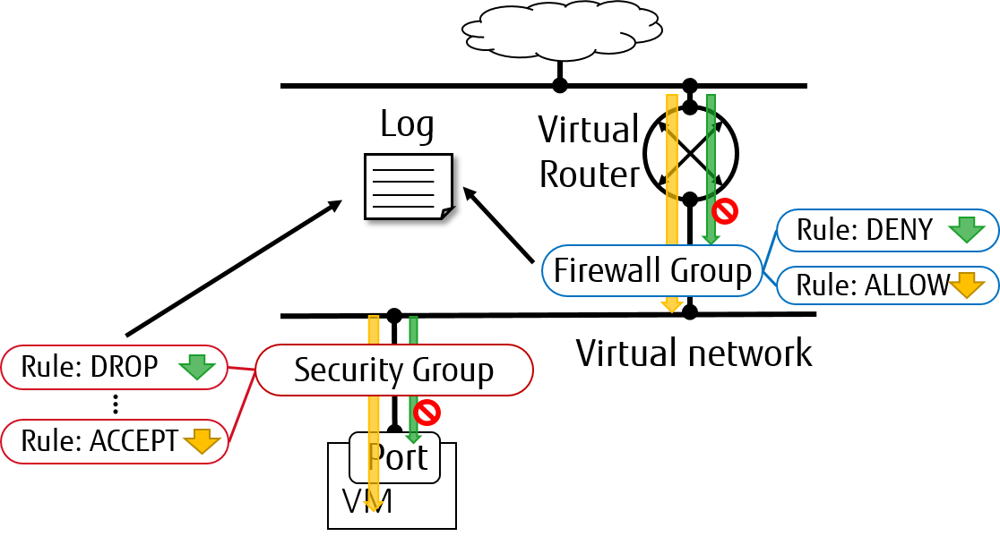

.. _config-logging:

================================
Neutron Packet Logging Framework
================================

Packet logging service is designed as a Neutron plug-in that captures network 
packets for relevant resources (e.g. security groups or firewall groups) when 
the logged events occur.

Supported logging resource types
~~~~~~~~~~~~~~~~~~~~~~~~~~~~~~~~

As of the Rocky release, the ``security_group`` and ``firewall_group`` are 
supported as loggable resource type in packet logging framework.

Service Configuration
~~~~~~~~~~~~~~~~~~~~~

To enable the logging service, follow the steps below.

#. On Neutron controller node, add ``log`` as a service to ``service_plugins``
   setting in ``/etc/neutron/neutron.conf`` file. For example:

   .. code-block:: none

     service_plugins = router,metering,log

#. To enable logging service for ``security_group`` in VM ports, add ``log`` to 
   ``[agent] extensions`` in ``/etc/neutron/plugins/ml2/ml2_conf.ini`` for 
   controller node and in ``/etc/neutron/plugins/ml2/openvswitch_agent.ini``
   for compute/network nodes. For example:

   .. code-block:: ini

     [agent]
     extensions = log

#. To enable logging service for ``firewall_group`` in internal router ports,
   add  ``fwaas_v2_log`` to the ``[AGENT] extensions`` setting in 
   ``/etc/neutron/l3_agent.ini`` for both controller node and network nodes. 
   For example:

   .. code-block:: ini

     [AGENT]
     extensions = fwaas_v2,fwaas_v2_log

#. On compute/network nodes, add configurations for logging feature to
   ``[network_log]`` in ``/etc/neutron/plugins/ml2/openvswitch_agent.ini`` as
   shown bellow:

    .. code-block:: ini

      [network_log]
      rate_limit = 100
      burst_limit = 25
      #local_output_log_base = <None>

    In which, ``rate_limit`` is used to configure the maximum number of packets
    to be logged per second (packets per second). When a high rate triggers
    ``rate_limit``, logging queues packets to be logged. ``burst_limit`` is
    used to configure the maximum of queued packets. And logged packets can be
    stored anywhere by using ``local_output_log_base``.

    .. note::

       - It requires at least ``100`` for ``rate_limit`` and at least ``25``
         for ``burst_limit``.
       - If ``rate_limit`` is unset, logging will log unlimited.
       - If we don't specify ``local_output_log_base``, logged packets will be
         stored in system journal like ``/var/log/syslog`` by default.

#. Trusted projects ``policy.json`` configuration

   With the default ``/etc/neutron/policy.json``, administrators must set up
   resource logging on behalf of the cloud projects.

   If projects are trusted to administer their own loggable resources  in their
   cloud, neutron's policy file ``policy.json`` can be modified to allow this.

   Modify ``/etc/neutron/policy.json`` entries as follows:

   .. code-block:: none

      "get_loggable_resources": "rule:regular_user",
      "create_log": "rule:regular_user",
      "get_log": "rule:regular_user",
      "get_logs": "rule:regular_user",
      "update_log": "rule:regular_user",
      "delete_log": "rule:regular_user",

Service workflow for Operator 
~~~~~~~~~~~~~~~~~~~~~~~~~~~~~

#. To check the loggable resources that are supported by framework:

   .. code-block:: console

      $ openstack network loggable resources list
      +-----------------+
      | Supported types |
      +-----------------+
      | security_group  |
      | firewall_group  |
      +-----------------+

   .. note::

      - In VM ports, logging for ``security_group`` in currently works with
        ``openvswitch`` firewall driver only.
      - Logging for ``firewall_group`` works on internal router ports only

#. Create a logging resource with an appropriate resource type:

   .. code-block:: console

      $ openstack network log create --resource-type security_group \
        --description "Collecting all security events" \
        --event ALL Log_Created
      +-----------------+------------------------------------------------+
      | Field           | Value                                          |
      +-----------------+------------------------------------------------+
      | Description     | Collecting all security events                 |
      | Enabled         | True                                           |
      | Event           | ALL                                            |
      | ID              | 8085c3e6-0fa2-4954-b5ce-ff6207931b6d           |
      | Name            | Log_Created                                    |
      | Project         | 02568bd62b414221956f15dbe9527d16               |
      | Resource        | None                                           |
      | Target          | None                                           |
      | Type            | security_group                                 |
      | created_at      | 2017-07-05T02:56:43Z                           |
      | revision_number | 0                                              |
      | tenant_id       | 02568bd62b414221956f15dbe9527d16               |
      | updated_at      | 2017-07-05T02:56:43Z                           |
      +-----------------+------------------------------------------------+

   .. note::

      - The ``Enabled`` field is set to ``True`` by default. If enabled, logged
        events is written to the destination if ``local_output_log_base`` is
        configured or ``/var/log/syslog`` in default.
      - ``Event`` field will be set to ``ALL`` if ``--event`` is not specified
        from log creation request.

#. Enable/Disable log

   We can ``enable`` or ``disable`` logging objects at runtime. It means that
   it will apply to all attached VM ports with the logging object immediately.
   For example:

   .. code-block:: console

      $ openstack network log set --disable Log_Created
      $ openstack network log show Log_Created
       +-----------------+------------------------------------------------+
       | Field           | Value                                          |
       +-----------------+------------------------------------------------+
       | Description     | Collecting all security events                 |
       | Enabled         | False                                          |
       | Event           | ALL                                            |
       | ID              | 8085c3e6-0fa2-4954-b5ce-ff6207931b6d           |
       | Name            | Log_Created                                    |
       | Project         | 02568bd62b414221956f15dbe9527d16               |
       | Resource        | None                                           |
       | Target          | None                                           |
       | Type            | security_group                                 |
       | created_at      | 2017-07-05T02:56:43Z                           |
       | revision_number | 1                                              |
       | tenant_id       | 02568bd62b414221956f15dbe9527d16               |
       | updated_at      | 2017-07-05T03:12:01Z                           |
       +-----------------+------------------------------------------------+

Events collected description
~~~~~~~~~~~~~~~~~~~~~~~~~~~~

Logging will collect ``ACCEPT`` or ``DROP`` or both events related to security group,
with the following general characteristics:

* Log every ``DROP`` event: Every ``DROP`` security event will be generated when
  an incoming or outgoing session is dropped, that is the new session is not
  allowed for the security group and because of that blocked.

* Log an ``ACCEPT`` event: An ``ACCEPT`` security event will be generated for each
  **NEW** incoming or outgoing session that is allowed by the ports security group.
  More details for the events follow below:

  * North/South ``ACCEPT``: For a North/South session there would be a single ``ACCEPT``
    event irrespective of direction.

  * East/West ``ACCEPT``/``ACCEPT``: In an intra-project East/West session where the
    security group on the originating port allows the session and the security
    group on the destination port allows the session, i.e. the traffic is allowed,
    there would be two ``ACCEPT`` security events generated, one from the perspective
    of the originating port and one from the perspective of the destination port.

  * East/West ``ACCEPT``/``DROP``: In an intra-project East/West session initiation
    where the security group on the originating port allows the session and the
    security group on the destination port does not allow the session there would
    be ``ACCEPT`` security events generated from the perspective of the originating
    port and ``DROP`` security events generated from the perspective of the
    destination port.

General data requirements: The security event should include:

* A status of the flow ``ACCEPT``/``DROP``.
* An indication of the originator of the flow, e.g which project or log resource
  generated the event.
* A timestamp of the flow.
* An identifier of the associated instance interface (neutron port id).
* An identifier of the matching security group rule.
* A layer 3 and 4 information (address, port, protocol, etc).

.. note::

   No other extraneous events are generated within the security event logs,
   e.g. no debugging data, etc.

* Security event record format:

  * Logged data of an ``ACCEPT`` event would look like:

  .. code-block:: console

      May 5 09:05:07 action=ACCEPT project_id=736672c700cd43e1bd321aeaf940365c
      log_resource_ids=['4522efdf-8d44-4e19-b237-64cafc49469b', '42332d89-df42-4588-a2bb-3ce50829ac51']
      vm_port=e0259ade-86de-482e-a717-f58258f7173f
      ethernet(dst='fa:16:3e:ec:36:32',ethertype=2048,src='fa:16:3e:50:aa:b5'),
      ipv4(csum=62071,dst='10.0.0.4',flags=2,header_length=5,identification=36638,offset=0,
      option=None,proto=6,src='172.24.4.10',tos=0,total_length=60,ttl=63,version=4),
      tcp(ack=0,bits=2,csum=15097,dst_port=80,offset=10,option=[TCPOptionMaximumSegmentSize(kind=2,length=4,max_seg_size=1460),
      TCPOptionSACKPermitted(kind=4,length=2), TCPOptionTimestamps(kind=8,length=10,ts_ecr=0,ts_val=196418896),
      TCPOptionNoOperation(kind=1,length=1), TCPOptionWindowScale(kind=3,length=3,shift_cnt=3)],
      seq=3284890090,src_port=47825,urgent=0,window_size=14600)

  * Logged data of a ``DROP`` event:

  .. code-block:: console

      May 5 09:05:07 action=DROP project_id=736672c700cd43e1bd321aeaf940365c
      log_resource_ids=['4522efdf-8d44-4e19-b237-64cafc49469b'] vm_port=e0259ade-86de-482e-a717-f58258f7173f
      ethernet(dst='fa:16:3e:ec:36:32',ethertype=2048,src='fa:16:3e:50:aa:b5'),
      ipv4(csum=62071,dst='10.0.0.4',flags=2,header_length=5,identification=36638,offset=0,
      option=None,proto=6,src='172.24.4.10',tos=0,total_length=60,ttl=63,version=4),
      tcp(ack=0,bits=2,csum=15097,dst_port=80,offset=10,option=[TCPOptionMaximumSegmentSize(kind=2,length=4,max_seg_size=1460),
      TCPOptionSACKPermitted(kind=4,length=2), TCPOptionTimestamps(kind=8,length=10,ts_ecr=0,ts_val=196418896),
      TCPOptionNoOperation(kind=1,length=1), TCPOptionWindowScale(kind=3,length=3,shift_cnt=3)],
      seq=3284890090,src_port=47825,urgent=0,window_size=14600)
